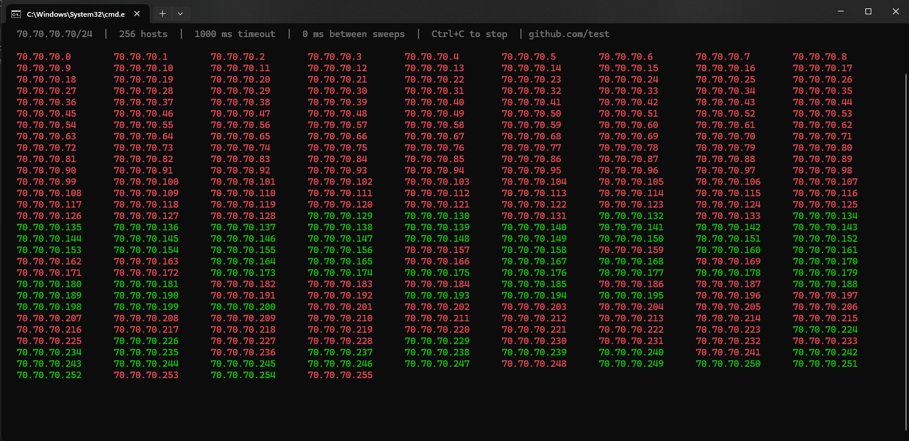

# subpinger

Ping an entire **IPv4 subnet** from a Windows console: one sweep at a time, **in parallel** (one thread per address), in a **loop** until you press **Ctrl+C**. Replies are **green**, timeouts/errors **red**, laid out in a **wrapped grid** with fixed column width so the list stays easy to read.



*Built for Windows only* (uses the system ICMP API).

## Run
download:
https://github.com/cobbotcp/subpinger/releases/download/v1.0.0/subpinger.exe

```bat
subpinger.exe 70.70.70.0/24
```

If the subnet has **more than 256** hosts, add **`-y`** to confirm. Use **`subpinger --help`** for all flags.

| Option | Meaning |
|--------|--------|
| `--timeout-ms <n>` | Per-ping timeout in ms (default: **1000**) |
| `--round-ms <n>` | Extra pause after each full sweep in ms (default: **0**) |
| `--max <n>` | Refuse if host count exceeds this; **0** = no cap (default: **4096**) |
| `-y`, `--yes` | Skip the large-subnet prompt |
| `-h`, `--help` | Show help text |

- **Ctrl+C** stops; the process waits for the current sweep and delay to finish.
- Redirecting stdout (e.g. to a file) uses plain text instead of the in-place console UI.

---

## Build (developers)

**Requirements:** **C++17** — **MinGW g++** or **MSVC** `cl`. Only builds on **Windows**.

**MinGW**

```bat
g++ -std=c++17 -O2 -o subpinger.exe subpinger.cpp -lws2_32 -liphlpapi
```

**Static EXE** (no extra MinGW/MSVC runtime DLLs on the target PC — still uses built-in Windows DLLs like `ws2_32` / `iphlpapi`):

```bat
g++ -std=c++17 -O2 -static -static-libgcc -static-libstdc++ -o subpinger.exe subpinger.cpp -lws2_32 -liphlpapi
```

**MSVC** (from a Developer Command Prompt)

```bat
cl /O2 /EHsc /MT /Fe:subpinger.exe subpinger.cpp /link ws2_32.lib iphlpapi.lib
```

Very large ranges spawn **many** threads per sweep; use `--max` if the machine runs out of resources.
